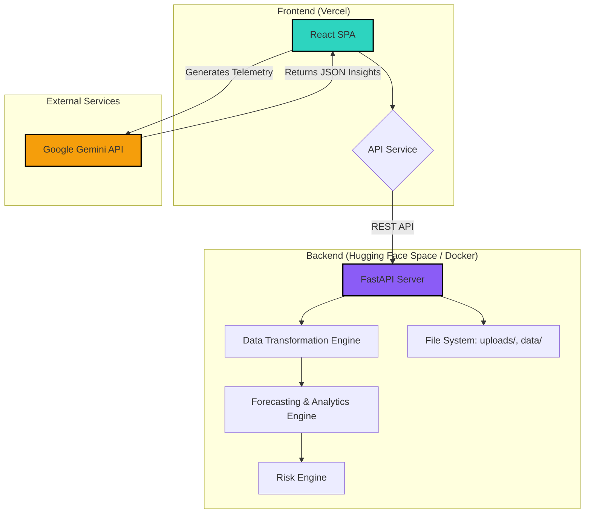
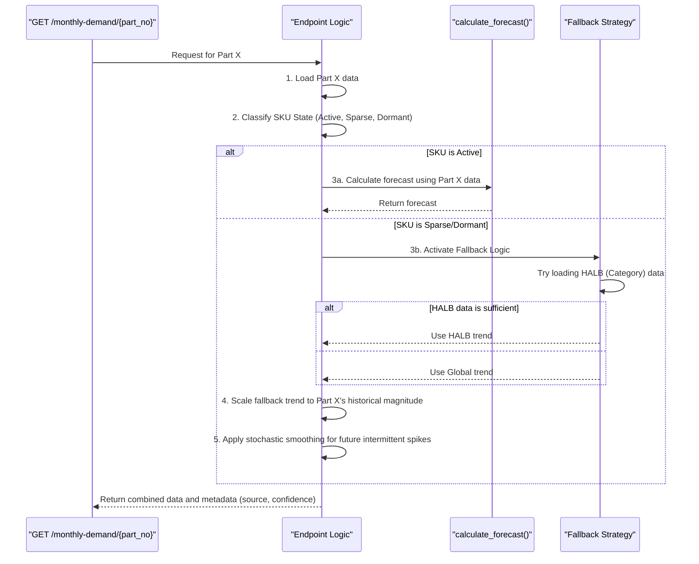
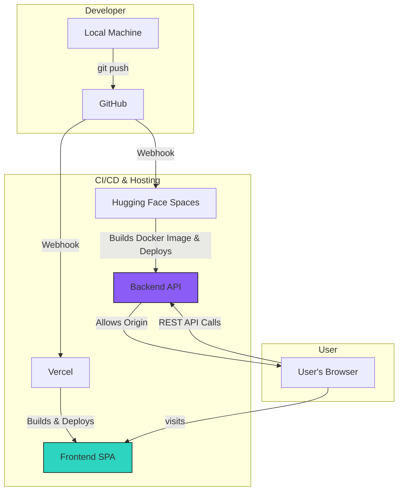

# 🏛️ Inventory Intelligence Platform: System Architecture

This document provides a comprehensive architectural overview of the Inventory Intelligence Platform, a full-stack operational analytics system designed for AI-powered demand forecasting, risk surveillance, and inventory optimization.

---

## 1. Project Overview

### 1.1. Purpose & Problem Statement

The Inventory Intelligence Platform was developed to address common, yet complex, challenges in inventory management, particularly for businesses dealing with large numbers of Stock Keeping Units (SKUs) and sparse or intermittent demand patterns.

Traditional analytics dashboards often fall short by only visualizing historical data. This platform aims to be an **operational decision-making tool** that transforms raw historical data into actionable, forward-looking intelligence. It is designed to provide not just forecasts, but also the context, confidence, and reasoning behind them.

### 1.2. Main Features

* **Smart Data Ingestion:** Handles CSV/Excel uploads with automatic data transformation.
* **Forecast Intelligence Engine:** Generates multi-horizon demand forecasts using a hybrid strategy for sparse and stable demand.
* **Hierarchical Forecasting:** Employs a multi-level fallback system (Part → Category → Global) to ensure forecast continuity.
* **Risk Intelligence Engine:** Calculates operational risk metrics and classifies SKUs into risk categories.
* **Inventory Command Center:** An interactive dashboard for monitoring KPIs, analyzing SKUs, and viewing AI-driven insights.
* **Explainable AI (XAI):** Provides operational telemetry tags and AI-generated summaries to explain forecast behavior.

### 1.3. Technology Stack

| Layer                     | Technology                                               |
| ------------------------- | -------------------------------------------------------- |
| **Frontend**        | React.js, Vite, TailwindCSS, Recharts, Lucide Icons      |
| **Backend**         | Python, FastAPI, Uvicorn                                 |
| **Data Processing** | Pandas, NumPy                                            |
| **AI Insights**     | Google Gemini API                                        |
| **Deployment**      | Docker, Hugging Face Spaces (Backend), Vercel (Frontend) |

### 1.4. High-Level Architecture

The system follows a decoupled frontend-backend architecture. The user interacts with a React single-page application (SPA) which communicates with a Python FastAPI backend via a REST API. The backend handles data ingestion, transformation, forecasting, and analytics, persisting data in memory and on the local filesystem for the session.



---

## 2. Folder Structure Explanation

The project is organized into two main directories: `frontend/` and `backend/`.

### 2.1. `backend/`

Contains the FastAPI application.

```
backend/
├── app/
│   ├── api/
│   │   ├── analytics.py  # Core forecasting, risk, and analytics endpoints.
│   │   └── upload.py     # File ingestion and data transformation endpoints.
│   ├── services/
│   │   └── risk_engine.py # Calculates risk scores and metrics for SKUs.
│   └── utils/
│       └── data_transformer.py # Logic to pivot data from wide to long format.
├── data/                   # Stores the transformed `transformed_data.csv`.
├── uploads/                # Temporarily stores raw uploaded Excel/CSV files.
├── main.py                 # FastAPI app entry point, mounts routers.
├── requirements.txt        # Python dependencies.
└── DOCKERFILE              # Docker configuration for backend deployment.
```

* **`app/api/`**: Defines the API routes. `upload.py` is the entry point for data, and `analytics.py` serves all data for the dashboards.
* **`app/services/`**: Contains business logic decoupled from the API layer. `risk_engine.py` is a prime example, holding the risk calculation algorithms.
* **`app/utils/`**: Houses reusable utility functions. `data_transformer.py` is critical for handling varied input data formats.
* **`data/` & `uploads/`**: These act as a simple file-based data store for a single session, making the application stateful to the uploaded file.

### 2.2. `frontend/`

Contains the React.js client-side application.

```
frontend/
├── src/
│   ├── components/
│   │   └── ai/
│   │       └── AIInsightPanel.jsx # Component to display Gemini/fallback insights.
│   ├── context/
│   │   └── DataContext.jsx      # React context for sharing dataset state.
│   ├── hooks/
│   │   └── useAIInsights.js     # Hook to manage Gemini API calls and fallbacks.
│   ├── pages/
│   │   ├── Upload.jsx           # UI for file upload and processing.
│   │   ├── Dashboard.jsx        # High-level executive command center.
│   │   ├── Forecast.jsx         # Detailed page for demand forecast analysis.
│   │   └── ...                  # Other dashboard pages.
│   ├── services/
│   │   ├── api.js               # Axios instance for backend communication.
│   │   └── geminiService.js     # Logic for calling the Google Gemini API.
│   └── utils/
│       ├── fallbackInsights.js  # Generates deterministic insights if Gemini fails.
│       └── recommendationEngine.js # Rule-based engine for generating actions.
├── .env.example              # Environment variable template.
└── vite.config.js            # Vite build configuration.
```

* **`src/pages/`**: Each file corresponds to a major view/route in the application (e.g., `/upload`, `/forecast`).
* **`src/services/`**: Manages external communication. `api.js` centralizes backend API calls, while `geminiService.js` isolates the generative AI functionality.
* **`src/hooks/`**: Custom React hooks encapsulate complex stateful logic, like the `useAIInsights` hook which orchestrates fetching AI-powered text.
* **`src/utils/`**: Contains client-side business logic and helper functions. The `fallbackInsights.js` and `recommendationEngine.js` are crucial for providing intelligence even when the AI service is unavailable.

---

## 3. Frontend Architecture

The frontend is a modern React Single-Page Application (SPA) built with Vite for fast development and optimized builds.

### 3.1. Component & Routing Flow

The UI is composed of pages, which are high-level components corresponding to application routes.

```mermaid
flowchart TD
    subgraph "React Router"
        R1["/"] --> P1[Upload Page];
        R2["/forecast"] --> P2[Forecast Page];
        R3["/risks"] --> P3[Risks Page];
        R4["/inventory"] --> P4[Inventory Page];
    end

    subgraph "Forecast Page Structure"
        P2 --> C1[PartSelector];
        P2 --> C2[KPI Cards];
        P2 --> C3[AIInsightPanel];
        P2 --> C4[Forecast Chart (Recharts)];
        P2 --> C5[Forecast Signals];
    end

    C3 -- uses --> H1(useAIInsights Hook);
    P2 -- fetches data via --> S1(API Service);

    style P1 fill:#0d9488,stroke:#fff
    style P2 fill:#0d9488,stroke:#fff
    style P3 fill:#0d9488,stroke:#fff
    style P4 fill:#0d9488,stroke:#fff
```

### 3.2. State Management

* **Local State (`useState`)**: Used for component-level state (e.g., loading flags, form inputs).
* **Shared State (`useContext`)**: A `DataContext` is used to hold the state of the processed dataset (`datasetPreview`), making it accessible across different pages without prop drilling.
* **Session Storage**: The frontend caches the `fileId`, `fileName`, and selected `sheetName` in `sessionStorage`. This provides a degree of state persistence across page reloads within the same browser tab.

### 3.3. API Communication & Data Flow

1. **API Service**: An Axios instance in `src/services/api.js` is configured with the backend base URL. All HTTP requests are channeled through this service.
2. **Upload Flow**:
   * The `Upload.jsx` page sends the raw file to `/api/upload`.
   * The backend returns a `file_id` and available `sheets`.
   * The user selects a sheet, and the frontend sends the `file_id` and `sheet_name` to `/api/process-sheet`.
   * The backend transforms the data and returns a preview and metrics, which are stored in the `DataContext`.
3. **Forecast Flow**:
   * The `Forecast.jsx` page fetches data from `/api/monthly-demand/{part_no}`.
   * The response contains the historical data, forecast data, and key metrics (`source`, `sku_state`, `confidence`, etc.).
   * This data is used to render KPI cards and the main `Recharts` line chart.
4. **AI Insights Flow**:
   * The `useAIInsights` hook observes changes in the forecast data.
   * It constructs a telemetry object summarizing the current state (e.g., `sparsity`, `forecastGrowth`, `confidence`).
   * This object is sent to `geminiService.js`, which calls the Google Gemini API.
   * If the API call succeeds, the structured JSON response is displayed.
   * If it fails or times out, `fallbackInsights.js` generates a deterministic, rule-based insight instead. This ensures the UI never appears broken.

---

## 4. Backend Architecture

The backend is a lightweight, high-performance API built with FastAPI, chosen for its async capabilities and automatic data validation via Pydantic.

### 4.1. Request Lifecycle & API Endpoints

A request to the backend follows this general path:

**Client → Uvicorn ASGI Server → FastAPI Routing → Pydantic Validation → API Endpoint Logic → Pandas/NumPy Processing → Pydantic Serialization → JSON Response**

#### Main Endpoints

**File Upload** (`/app/api/upload.py`)

* `POST /api/upload`

  * **Purpose**: Receives a file (`.csv` or `.xlsx`).
  * **Request**: `UploadFile` (multipart/form-data).
  * **Process**: Saves the file to the `/uploads` directory with a unique ID. If it's an Excel file, it lists the sheet names.
  * **Response**: `{ "file_id": "...", "sheets": ["..."] }`
* `POST /api/process-sheet`

  * **Purpose**: Triggers the main data transformation pipeline.
  * **Request Body**: `{ "file_id": "...", "sheet_name": "..." }`
  * **Process**:
    1. Reads the specified sheet from the uploaded file into a Pandas DataFrame.
    2. Calls `transform_dataset` utility to convert the data into a long time-series format.
    3. Saves the result to `data/transformed_data.csv`, overwriting any previous data.
    4. Calculates summary metrics (total rows, parts, demand).
  * **Response**: `{ "total_rows": ..., "columns": ..., "sample_data": [...] }`

**Forecasting & Analytics** (`/app/api/analytics.py`)

* `GET /api/monthly-demand` & `GET /api/monthly-demand/{part_no}`

  * **Purpose**: The primary endpoint for all forecasting and SKU-level analysis.
  * **Request**: Optional `part_no` path parameter.
  * **Process**: This is the core of the application's intelligence. See the **Forecasting Pipeline** section for a detailed breakdown. It involves loading data, classifying SKU behavior, selecting a forecast strategy, calculating the forecast, and returning all associated metadata.
  * **Response**: `{ "items": [...], "source": "...", "sku_state": "...", "confidence": "...", "sparsity": ..., "confidence_score": ... }`
* `GET /api/inventory-risk`

  * **Purpose**: Calculates and returns risk metrics for all SKUs.
  * **Process**: Loads the transformed data and passes it to the `calculate_inventory_risk` function in the `risk_engine` service.
  * **Response**: A list of objects, each representing a SKU with its calculated risk profile.
* `GET /api/parts`

  * **Purpose**: Retrieves a unique, sorted list of all part numbers.
  * **Response**: `["PART-001", "PART-002", ...]`

### 4.2. In-Memory Caching

The `analytics.py` module uses a simple in-memory caching mechanism for the main DataFrame (`transformed_data.csv`).

```python
# From backend/app/api/analytics.py
_cached_df = None
_cached_mtime = 0

def get_cached_df():
    # ...
    current_mtime = os.path.getmtime(DATA_FILE)
    # Reload if file was modified (e.g., new upload)
    if _cached_df is None or current_mtime > _cached_mtime:
        _cached_df = pd.read_csv(DATA_FILE, low_memory=False)
        _cached_mtime = current_mtime
    return _cached_df
```

This prevents re-reading the CSV from disk for every API call, significantly improving performance for filtering and forecasting operations after the initial data processing step. The cache is invalidated automatically whenever the underlying `transformed_data.csv` file is modified (i.e., on a new file upload).

---

## 5. Forecasting Pipeline

The forecasting pipeline is the intellectual core of the backend. It's a rule-based, hierarchical system designed specifically to handle the "sparse demand" problem. It does not use traditional ML models like ARIMA or Prophet but instead relies on statistical methods and adaptive logic.



### Pipeline Steps:

1. **Data Aggregation**: The `get_monthly_demand_df` function aggregates all transactions for a given part (or category/all parts) into a monthly time series.
2. **SKU Classification (Triage)**: Before forecasting, the system classifies the SKU's behavior based on its history:

   * **INACTIVE**: Total demand is zero.
   * **DORMANT**: Very few data points (<= 2 non-zero months).
   * **SPARSE**: High ratio of zero-demand months (>70%) or few non-zero months (<6).
   * **ACTIVE**: Sufficient historical data.
3. **Strategy Selection**: Based on the classification, a forecast source is chosen:

   * `PART_LEVEL`: For `ACTIVE` SKUs.
   * `HALB_FALLBACK`: For `SPARSE`/`DORMANT` SKUs, if a valid category (`HALB`) is present.
   * `GLOBAL_FALLBACK`: If category data is unavailable or insufficient.
   * `NO_FORECAST`: For `INACTIVE` SKUs.
4. **Forecast Calculation (`calculate_forecast`)**:

   * **Historical Forecast**: A 3-month rolling average is calculated on historical demand to show the past trend. For sparse data, a non-zero moving average is used to avoid flattening spikes.
   * **Future Projection**:
     * **For Active SKUs**: An iterative moving average projects the future. The last 3 known values seed the forecast, and each new predicted value is added to the window to predict the next.
     * **For Sparse SKUs (The Core IP)**: This is the most complex step.
       1. **Get Trend Direction**: The trend from the fallback source (HALB or Global) is used to determine the general direction (up, down, or flat).
       2. **Get Historical Scale**: The baseline demand is calculated from the SKU's own non-zero historical data (e.g., the mean of the last 3 sales).
       3. **Scaled Forecast**: The forecast is `Baseline * Trend_Direction`. This ensures the forecast respects the SKU's typical order size, while following the broader market trend.
       4. **Intermittent Spike Generation**: To model real-world sparse demand, future forecasts are not flat. The system uses a pseudo-random process (seeded by the part number for consistency) to create "spikes" based on the historical sparsity ratio. The amplitude of these spikes is scaled to preserve the total forecasted volume over the period.
       5. **Safeguards**: The final forecast is capped to prevent unrealistic explosions in value, using a ceiling based on the historical maximum demand.
5. **Output Generation**: The final payload combines historical demand, the generated forecast, and metadata like `source`, `sku_state`, and `confidence_score` for the frontend.

---

## 6. Data Flow Architecture

The end-to-end data flow is designed to transform raw, wide-format operational data into interactive, forward-looking intelligence.

```mermaid
graph TD
    A[User uploads Excel/CSV] --> B{POST /api/upload};
    B --> C[File saved to /uploads];
    C --> D{POST /api/process-sheet};
    D --> E[1. Read file with Pandas];
    E --> F[2. Transform wide to long format];
    F --> G[3. Save to data/transformed_data.csv];
    G --> H{GET /api/monthly-demand};
    H --> I[4. Load from CSV (or cache)];
    I --> J[5. Run Forecasting Pipeline];
    J --> K[6. Generate JSON Response];
    K --> L[Frontend Renders Chart & KPIs];

    subgraph "User Action"
        A
    end
    subgraph "Backend Processing"
        B
        C
        D
        E
        F
        G
        H
        I
        J
        K
    end
    subgraph "Frontend Rendering"
        L
    end

    style A fill:#2dd4bf,stroke:#000
    style L fill:#2dd4bf,stroke:#000
```

---

## 7. Deployment Architecture

The application is deployed using a modern, decoupled CI/CD workflow suitable for JAMstack-style applications.

* **Backend**: The FastAPI application is containerized using the provided `DOCKERFILE`. This Docker image is deployed to **Hugging Face Spaces**. Hugging Face automatically manages the build and deployment, exposing the application on a public URL. The `CMD` in the Dockerfile starts the Uvicorn server, making the API accessible on port 7860 within the container.
* **Frontend**: The React application is deployed on **Vercel**. Vercel is connected to the GitHub repository. A `git push` to the main branch automatically triggers a new build (`vite build`) and deployment.
* **Communication**: The frontend communicates with the backend via the public Hugging Face Space URL, which is stored as an environment variable (`VITE_API_BASE_URL`) in Vercel.



### CORS (Cross-Origin Resource Sharing)

Since the frontend and backend are on different domains, CORS must be configured. The FastAPI backend uses `CORSMiddleware` to allow requests from the Vercel frontend's domain.

---

## 8. Performance & Optimization

Several strategies are used to ensure the application is responsive and efficient.

* **Backend Caching**: As mentioned, the primary dataset is cached in memory (`_cached_df`) to minimize disk I/O on subsequent API calls.
* **Efficient Data Processing**: The backend leverages vectorized operations in Pandas and NumPy for data manipulation, which is significantly faster than native Python loops.
* **`low_memory=False`**: When reading CSVs, this is used to prevent Pandas from inferring data types in chunks, which can be slow and memory-intensive for mixed-type columns.
* **Async Endpoints**: FastAPI endpoints are defined with `async def`, allowing the server to handle other requests while waiting for I/O operations (though current file-based I/O is blocking).
* **Frontend Code Splitting**: Vite automatically splits the JavaScript bundle by routes (pages). This means the user only downloads the code for the `Upload` page initially, and the code for the `Forecast` page is only loaded when they navigate to it.
* **Frontend Virtualization (Implicit)**: While not explicitly implemented with a library like `react-virtual`, the `PartSelector` dropdown limits the rendered items to 100, preventing the DOM from being overloaded with thousands of elements.
* **Optimistic UI & Fallbacks**: The AI insight generation includes a timeout and a fallback mechanism. This ensures the UI remains fast and responsive, providing a good user experience even if the external Gemini API is slow or unavailable.

---

## 9. Security Considerations

While this is an internal/demo-level application without user authentication, several security best practices are in place.

* **CORS**: The backend is configured to only accept requests from the specific frontend domain, preventing other websites from interacting with the API.
* **File Validation**: The upload endpoint checks file extensions. The processing logic defensively checks for required columns (`Part No`) and handles empty or invalid sheets gracefully, preventing backend crashes from malformed user input.
* **Input Sanitization (Implicit)**: Pydantic automatically validates incoming request bodies, ensuring that data types match expectations. Pandas' `to_numeric` with `errors='coerce'` further sanitizes data by turning non-numeric values into `NaN`, which are then handled.
* **Environment Variables**: Sensitive information like the `VITE_GEMINI_API_KEY` is managed via environment variables and is not hardcoded in the source. The key is used on the client-side, which is suitable for a demo but would need to be moved to a backend-for-frontend proxy in a production environment.
* **Error Handling**: Both frontend and backend use `try...catch` blocks to handle unexpected errors during API calls or data processing, displaying user-friendly error messages instead of crashing.

---

## 10. Future Improvements

The current architecture provides a strong foundation. The following enhancements would elevate it to a production-grade enterprise system.

* **Authentication & Authorization**: Implement an authentication layer (e.g., OAuth2, JWT) to secure the API and support multi-user environments.
* **Persistent Database**: Replace the file-based storage (`data/transformed_data.csv`) with a proper database (e.g., PostgreSQL, Snowflake) to handle larger datasets, concurrent users, and data versioning.
* **Cloud Storage**: Use a cloud storage solution (e.g., AWS S3, Google Cloud Storage) for raw file uploads instead of the local filesystem.
* **Background Jobs & Async Queues**: For time-consuming data transformations, move the processing to a background worker using a task queue like Celery with Redis or RabbitMQ. The API could then immediately return a `job_id`, and the frontend could poll for completion status.
* **ML Model Registry**: To incorporate more advanced ML models (e.g., Prophet, XGBoost), a model registry (like MLflow) would be needed to version, store, and serve different forecasting models.
* **Backend-for-Frontend (BFF) for AI Calls**: Move the Gemini API call from the frontend to the backend. This would protect the API key and allow for more complex server-side prompt engineering and caching of AI responses.
* **Streaming Analytics & Monitoring**: For real-time inventory updates, integrate streaming technologies like Kafka and set up proper logging and monitoring with tools like Prometheus and Grafana.

---
