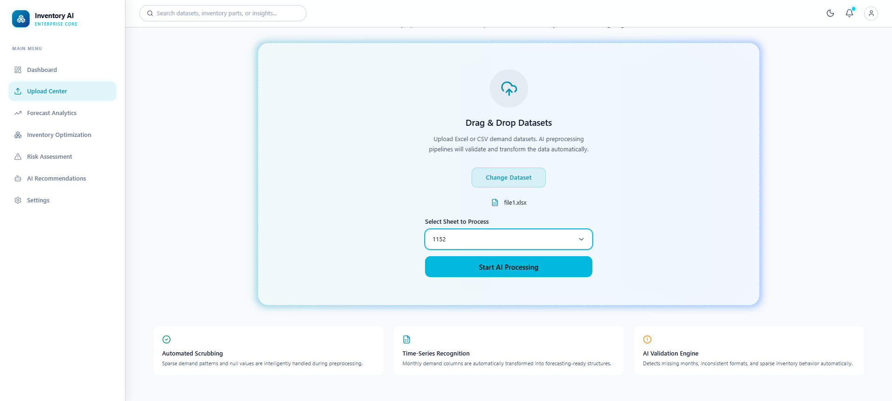
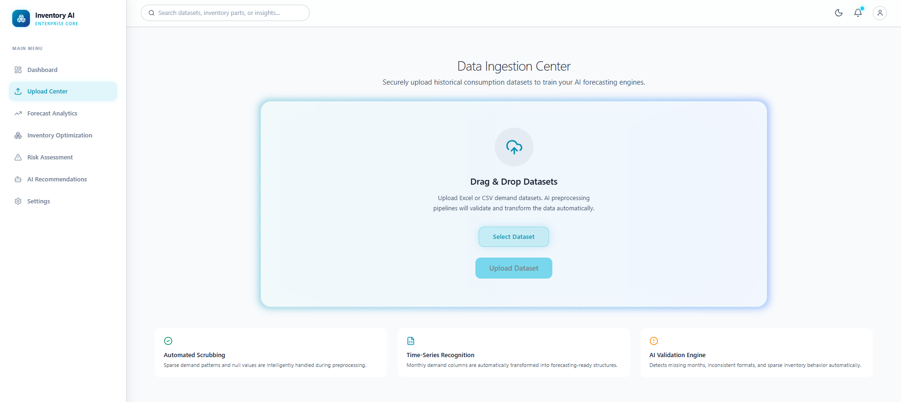
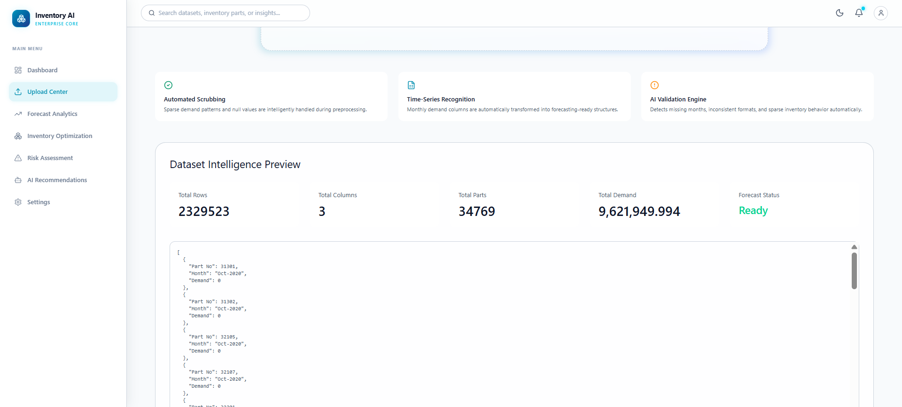

# Inventory Intelligence Platform

**AI-Powered Inventory Forecasting & Operational Intelligence Platform**

[](https://inventory-intelligence.vercel.app)
[](https://huggingface.co/spaces/inventory-intelligence/api)
[](https://react.dev)
[](https://fastapi.tiangolo.com)
[](https://python.org)

---

## Overview

Inventory Intelligence Platform is an enterprise-grade, AI-driven operational intelligence system designed for supply chain analytics, demand forecasting, inventory risk assessment, and automated recommendations. The platform transforms raw inventory data into actionable intelligence through a sophisticated multi-engine architecture.

Built for operations teams, supply chain analysts, and inventory managers, the platform provides real-time visibility into stock health, demand patterns, and risk exposure across thousands of SKUs.

---

## Screenshots

> *Screenshots to be added. Place your dashboard, forecast, inventory, and risk page screenshots in the `image/README/` directory.*

| Dashboard | Forecasting |
|-----------|-------------|
|  |  |

| Inventory Analytics | Risk Assessment |
|--------------------|-----------------|
|  |  |

| AI Insights | Recommendations |
|-------------|-----------------|
|  |  |

---

## Features

### 🔮 Forecasting Engine
- Multi-strategy demand forecasting with 3-month rolling average
- Sparse demand detection and specialized handling for intermittent SKUs
- HALB (category-level) fallback for low-confidence forecasts
- 12-month forward projection with iterative moving average
- Confidence scoring with volatility-adjusted metrics
- Per-SKU forecast state classification (ACTIVE, SPARSE, DORMANT, INACTIVE)

### 📦 Inventory Optimization
- Real-time inventory risk scoring across all SKUs
- Multi-dimensional risk assessment (volatility, sparsity, forecast growth)
- Automated stock-out prediction with ETA calculation
- Safety stock recommendations based on risk profiles
- Inventory health distribution (Healthy, Monitor, At Risk, Critical)

### ⚠️ Risk Assessment
- Composite risk scoring engine with weighted dimensions
- SKU state classification (Stable, Volatile, Sparse, Dormant, Surging)
- Explainable risk tagging with root cause identification
- Demand trend analysis (UP, DOWN, STABLE)
- Confidence scoring per SKU with transparency

### 🤖 Recommendation Engine
- AI-driven operational insights with severity classification
- Automated action recommendations (Increase Safety Stock, Monitor Closely, Maintain)
- Critical alert generation for high-risk SKUs
- Telemetry-based insight generation
- Fallback insight templates for offline resilience

### 📊 Export System
- Multi-format forecast export (CSV, XLSX)
- Streaming export for large datasets with 50,000 row limit
- Confidence interval inclusion (Lower/Upper bounds)
- Risk metadata embedded in exports
- Memory-efficient generator-based architecture

### 📤 Upload & Processing Pipeline
- Multi-sheet Excel and CSV file support
- Automatic sheet detection and selection
- Intelligent column normalization (Part Number, SKU, Item → Part No)
- Wide-to-long format transformation
- Data validation with descriptive error messages
- Streaming file upload to disk

### 📈 Operational Dashboard
- Real-time KPI monitoring (8 metric cards with sparklines)
- Global demand vs AI forecast visualization
- Risk distribution pie chart with drill-down
- High-risk SKU table with actionable recommendations
- Inventory health bar chart
- AI Insight Engine panel with severity-coded cards
- Critical alert banner with animated indicators

### 🧠 AI Insights
- Severity-classified insights (CRITICAL, WARNING, OPTIMIZATION, INFO)
- Confidence-scored recommendations
- Gemini API integration for enhanced intelligence
- Local fallback insight generation engine
- Cached insight delivery for performance

---

## Architecture Overview

```
┌─────────────────────────────────────────────────────────────┐
│                    Frontend (Vercel)                         │
│  ┌──────────┐  ┌──────────┐  ┌──────────┐  ┌────────────┐  │
│  │Dashboard │  │Forecast  │  │Inventory │  │Recommend.  │  │
│  │  Page    │  │  Page    │  │  Page    │  │  Page      │  │
│  └────┬─────┘  └────┬─────┘  └────┬─────┘  └─────┬──────┘  │
│       └──────────────┴─────────────┴──────────────┘         │
│                        │                                     │
│              ┌─────────▼──────────┐                          │
│              │   React Context    │                          │
│              │   (DataContext)    │                          │
│              └─────────┬──────────┘                          │
│                        │                                     │
│              ┌─────────▼──────────┐                          │
│              │   API Service      │                          │
│              │   (Axios Client)   │                          │
│              └─────────┬──────────┘                          │
└────────────────────────┼─────────────────────────────────────┘
                         │ HTTP / JSON
┌────────────────────────┼─────────────────────────────────────┐
│              ┌─────────▼──────────┐     Backend (HF Spaces)  │
│              │   FastAPI Server   │                          │
│              │   (Uvicorn)        │                          │
│              └─────────┬──────────┘                          │
│                        │                                     │
│        ┌───────────────┼───────────────┐                     │
│        ▼               ▼               ▼                     │
│  ┌──────────┐   ┌──────────┐   ┌──────────────┐             │
│  │ Upload   │   │Analytics │   │  Forecast    │             │
│  │ Router   │   │ Router   │   │  Router      │             │
│  └────┬─────┘   └────┬─────┘   └──────┬───────┘             │
│       │              │                │                      │
│       ▼              ▼                ▼                      │
│  ┌──────────┐   ┌──────────┐   ┌──────────────┐             │
│  │Data      │   │Risk      │   │Forecast      │             │
│  │Transformer│   │Engine    │   │Calculator    │             │
│  └────┬─────┘   └────┬─────┘   └──────┬───────┘             │
│       │              │                │                      │
│       └──────────────┴────────────────┘                      │
│                      │                                       │
│              ┌───────▼────────┐                              │
│              │  Pandas/NumPy  │                              │
│              │  Data Layer    │                              │
│              └───────┬────────┘                              │
│                      │                                       │
│              ┌───────▼────────┐                              │
│              │  CSV Storage   │                              │
│              │  (transformed) │                              │
│              └────────────────┘                              │
└──────────────────────────────────────────────────────────────┘
```

---

## Tech Stack

### Frontend
| Technology | Version | Purpose |
|------------|---------|---------|
| React | 19.x | UI framework with hooks-based architecture |
| Vite | 8.x | Build tool and dev server with HMR |
| TailwindCSS | 4.x | Utility-first CSS framework |
| Recharts | 3.x | Composable charting library |
| React Router | 7.x | Client-side routing |
| Axios | 1.x | HTTP client for API communication |
| Lucide React | 1.x | Icon component library |
| React Window | 2.x | Virtualized list rendering |

### Backend
| Technology | Version | Purpose |
|------------|---------|---------|
| FastAPI | 0.115+ | Async Python web framework |
| Uvicorn | - | ASGI server |
| Pandas | 2.x | Data manipulation and analysis |
| NumPy | 1.x | Numerical computing |
| Python-dateutil | - | Date parsing utilities |
| OpenPyXL | - | Excel file reading |
| XlsxWriter | - | Excel file writing |

### Deployment
| Platform | Component | URL |
|----------|-----------|-----|
| Vercel | Frontend | [Production URL] |
| HuggingFace Spaces | Backend API | [Backend URL] |

---

## Installation

### Prerequisites
- Node.js 18+ and npm/pnpm
- Python 3.11+
- Git

### Local Setup

#### 1. Clone the Repository
```bash
git clone https://github.com/Sarthak156/Inventory-Intelligence-Platform.git
cd inventory-intelligence-platform
```

#### 2. Backend Setup
```bash
cd backend

# Create virtual environment
python -m venv venv

# Activate (Windows)
venv\Scripts\activate

# Activate (macOS/Linux)
source venv/bin/activate

# Install dependencies
pip install -r requirements.txt

# Start the server
uvicorn main:app --reload --host 0.0.0.0 --port 8000
```

#### 3. Frontend Setup
```bash
cd frontend

# Install dependencies
npm install

# Start development server
npm run dev
```

#### 4. Access the Application
- Frontend: http://localhost:5173
- Backend API: http://localhost:8000
- API Docs: http://localhost:8000/docs

---

## Environment Setup

### Backend (.env)
```env
# Backend Configuration
FRONTEND_URL=http://localhost:5173
```

### Frontend (.env)
```env
# API Base URL (for production deployment)
VITE_API_BASE_URL=https://your-backend-url.space
```

---

## Deployment

### Frontend (Vercel)
```bash
cd frontend
npm run build
vercel --prod
```

### Backend (HuggingFace Spaces)
1. Create a new Space at [huggingface.co/spaces](https://huggingface.co/spaces)
2. Select Docker SDK
3. Push the `backend/` directory
4. Set environment variables in Space settings

---

## Folder Structure

```
inventory-intelligence-platform/
├── README.md
├── .env.example
├── .gitignore
├── ARCHITECTURE.md
├── INVESTIGATION_REPORT.md
├── icon.png
├── logo.png
├── datasets/
│   └── file1.xlsx
├── image/
│   └── README/
│       ├── 1782031373576.png
│       ├── 1782031393859.png
│       ├── 1782031437561.png
│       ├── 1782031442317.png
│       ├── 1782031448232.png
│       ├── 1782031452013.png
│       ├── 1782031455668.png
│       ├── 1782031459929.png
│       ├── 1782031474671.png
│       ├── 1782031493653.png
│       ├── 1782031521878.png
│       ├── 1782031533150.png
│       ├── 1782031543035.png
│       └── 1782031549383.png
├── docs/
│   ├── ARCHITECTURE.md
│   ├── SYSTEM_DESIGN.md
│   ├── API_REFERENCE.md
│   ├── DEPLOYMENT_GUIDE.md
│   ├── RUNBOOK.md
│   ├── SUPPORT_GUIDE.md
│   ├── KNOWN_ISSUES.md
│   ├── ROADMAP.md
│   ├── CHANGELOG.md
│   ├── PERFORMANCE_OPTIMIZATION.md
│   ├── DATA_SCHEMA.md
│   ├── FORECASTING_ENGINE.md
│   ├── INVENTORY_OPTIMIZATION.md
│   ├── RECOMMENDATION_ENGINE.md
│   ├── TROUBLESHOOTING.md
│   ├── SECURITY.md
│   └── CONTRIBUTING.md
├── backend/
│   ├── main.py
│   ├── Dockerfile
│   ├── requirements.txt
│   ├── .env
│   ├── .gitignore
│   ├── README.md
│   ├── app/
│   │   ├── api/
│   │   │   ├── upload.py
│   │   │   ├── analytics.py
│   │   │   └── forecast.py
│   │   ├── services/
│   │   │   └── risk_engine.py
│   │   ├── utils/
│   │   │   └── data_transformer.py
│   │   └── validation/
│   │       └── data_validator.py
│   ├── data/
│   │   └── transformed_data.csv
│   └── uploads/
├── frontend/
│   ├── index.html
│   ├── package.json
│   ├── vite.config.js
│   ├── tailwind.config.js
│   ├── postcss.config.js
│   ├── eslint.config.js
│   ├── .env
│   ├── .env.example
│   ├── .gitignore
│   ├── public/
│   │   ├── favicon.svg
│   │   └── icons.svg
│   └── src/
│       ├── main.jsx
│       ├── App.jsx
│       ├── App.css
│       ├── index.css
│       ├── spatial.css
│       ├── assets/
│       │   ├── hero.png
│       │   ├── react.svg
│       │   └── vite.svg
│       ├── context/
│       │   ├── DataContext.jsx
│       │   └── ReactContexts.jsx
│       ├── hooks/
│       │   └── useAIInsights.js
│       ├── layouts/
│       │   └── MainLayout.jsx
│       ├── pages/
│       │   ├── Dashboard.jsx
│       │   ├── Forecast.jsx
│       │   ├── Inventory.jsx
│       │   ├── Risks.jsx
│       │   ├── Recommendations.jsx
│       │   ├── Upload.jsx
│       │   ├── Settings.jsx
│       │   ├── ExportButton.jsx
│       │   ├── ExportForecastModal.jsx
│       │   └── MultiSelectPartsDropdown.jsx
│       ├── components/
│       │   ├── ai/
│       │   │   ├── AIInsightPanel.jsx
│       │   │   ├── AIStatus.jsx
│       │   │   ├── ExecutiveBriefing.jsx
│       │   │   └── LoadingPulse.jsx
│       │   ├── recommendations/
│       │   │   ├── AIInsightDrawer.jsx
│       │   │   ├── AIRecommendationCard.jsx
│       │   │   ├── PaginationControls.jsx
│       │   │   ├── RecommendationFilters.jsx
│       │   │   ├── RecommendationModal.jsx
│       │   │   ├── RecommendationTable.jsx
│       │   │   └── VirtualizedRecommendationList.jsx
│       │   └── sidebar/
│       │       └── Sidebar.jsx
│       └── services/
│           ├── api.js
│           ├── aiInsights.js
│           ├── geminiService.js
│           └── utils/
│               ├── aiInsightCache.js
│               ├── fallbackInsights.js
│               ├── insightTemplates.js
│               └── recommendationEngine.js
```

---

## Usage

### 1. Upload Data
Navigate to the **Upload** page. Upload an Excel (.xlsx) or CSV file containing inventory data with columns like Part Number, monthly demand values, and optional metadata.

### 2. Process Sheet
Select the appropriate sheet from your uploaded file. The system automatically transforms wide-format data into a normalized long format.

### 3. Explore Dashboard
The **AI Operations Command Center** provides real-time KPIs, risk distribution, demand vs forecast visualization, and AI-generated insights.

### 4. Analyze Forecasts
The **Forecast** page provides per-SKU demand forecasting with confidence scoring, state classification, and 12-month forward projections.

### 5. Assess Inventory Risk
The **Inventory** page offers searchable, filterable inventory data with pagination. The **Risks** page provides detailed risk scoring and classification.

### 6. Review Recommendations
The **Recommendations** page surfaces AI-driven operational recommendations with severity classification and actionable guidance.

### 7. Export Forecasts
Use the **Export** feature to download forecast data in CSV or Excel format with confidence intervals and risk metadata.

---

## Future Roadmap

| Phase | Features |
|-------|----------|
| **Phase 1** | Authentication & RBAC, Real-time Forecasting, Redis Caching |
| **Phase 2** | Async Exports, Background Jobs, Anomaly Detection, Supplier Intelligence |
| **Phase 3** | ERP Integrations, AI Copilots, Predictive Procurement, Multi-warehouse |

---

## License

This project is licensed under the MIT License.

---

## Acknowledgments

- Built with React, FastAPI, and the open-source ecosystem
- Deployed on Vercel and HuggingFace Spaces
- Powered by Pandas, NumPy, and Scikit-learn