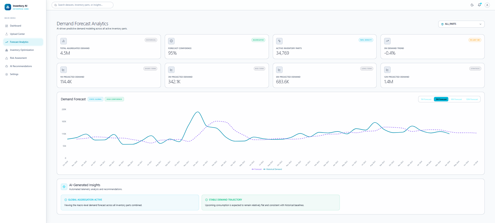
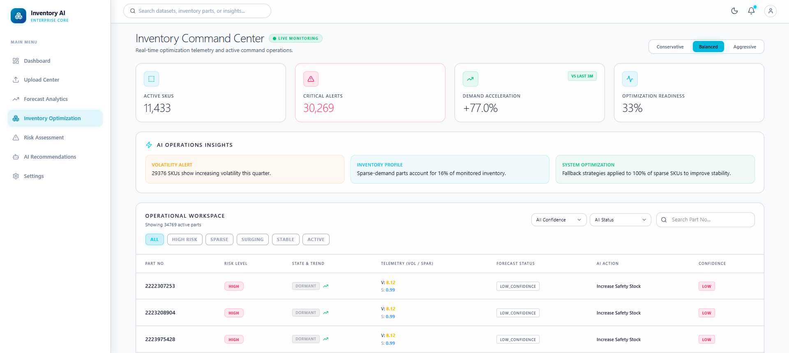
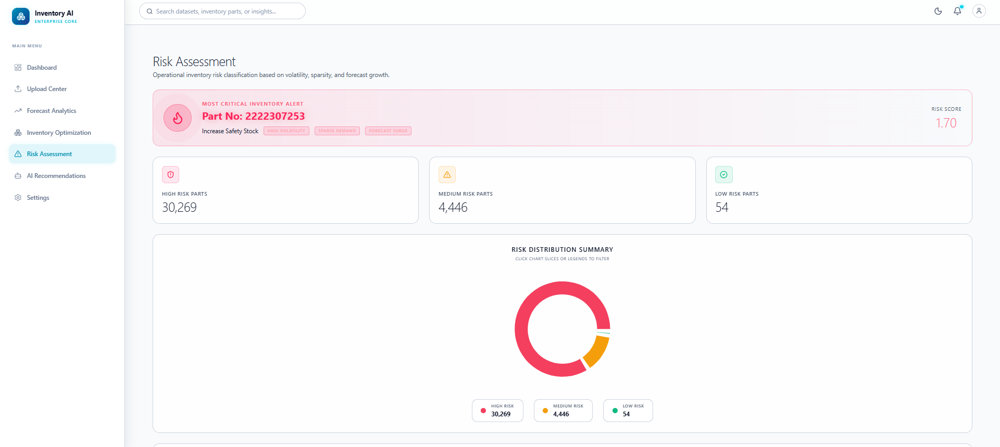
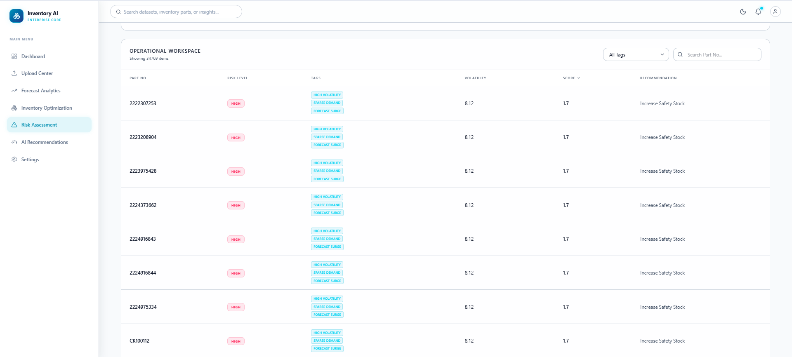
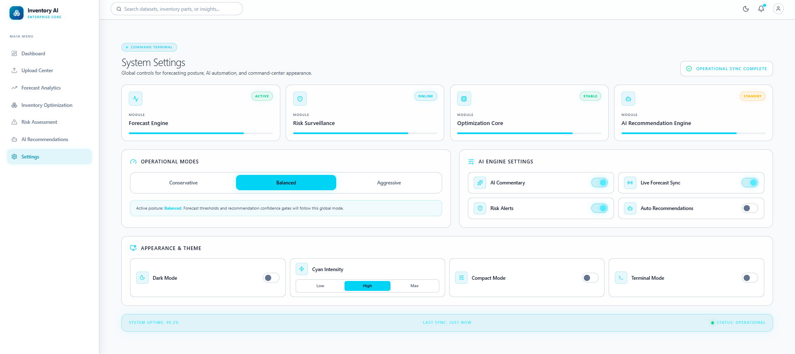

# 🚀 Inventory Intelligence Platform

> AI-Powered Forecasting, Risk Surveillance & Inventory Optimization System
> Built during internship as an enterprise-style operational intelligence platform.

---

# 📌 Overview

The **Inventory Intelligence Platform** is a full-stack operational analytics system designed to transform raw inventory and demand datasets into actionable intelligence through:

* 📈 Forecasting & Demand Analytics
* ⚠️ Risk Surveillance
* 📦 Inventory Optimization
* 🧠 Explainable AI Insights
* 🏛️ Enterprise Operational Dashboards

Unlike traditional dashboards that only visualize historical data, this platform focuses on:

* operational decision-making
* sparse-demand forecasting
* explainability
* interactive intelligence workflows
* enterprise-grade UX systems

The project evolved from a basic forecasting dashboard into a multi-layer operational intelligence platform inspired by modern enterprise analytics systems.

---

# 🎯 Key Objectives

The system was designed to solve real-world inventory forecasting and monitoring challenges such as:

* Sparse and intermittent demand
* Large-scale SKU monitoring
* Forecast instability
* Operational risk analysis
* Inventory intelligence generation
* Explainable forecasting workflows

---

# 🏗️ System Architecture

```text
Excel / CSV Upload
        ↓
Data Transformation Engine
        ↓
Preprocessing & Aggregation
        ↓
Forecast Intelligence Layer
        ↓
Risk Analytics Engine
        ↓
Inventory Optimization Engine
        ↓
Operational Intelligence Dashboard
```

---

# ⚙️ Core Features

---

## 📂 1. Smart Data Ingestion System

### Supported Formats

* CSV
* XLSX / Excel

### Features

* Multi-sheet Excel support
* Dynamic sheet selection
* Dataset preview system
* Automatic transformation pipeline
* Large dataset handling
* Date normalization
* Missing value handling

### Highlights

* Handles datasets with 35k+ rows efficiently
* Prevents transformation failures caused by inconsistent formatting

---

# 📈 2. Forecast Intelligence Engine

The forecasting module analyzes historical demand patterns and generates operational demand projections.

---

## Forecasting Features

### ✅ Multi-Horizon Forecasting

Supports:

* 1 Month Forecast
* 3 Month Forecast
* 6 Month Forecast
* 12 Month Forecast

---

### ✅ Part-Wise Forecasting

Each inventory part is forecasted individually to provide SKU-level intelligence.

---

### ✅ Rolling Trend Analytics

* Rolling averages
* Demand smoothing
* Trend stabilization

---

### ✅ Hybrid Sparse-Demand Forecasting

One of the most important features of the platform.

The system intelligently handles:

* sparse demand
* intermittent inventory activity
* inactive SKUs
* unstable historical patterns

Using:

* hierarchical fallback strategies
* adaptive forecasting continuity
* operational governance logic

---

# 🧠 3. Hierarchical Forecasting Strategy

The platform uses a layered forecasting architecture:

```text
PART LEVEL
    ↓
HALB LEVEL
    ↓
GLOBAL FALLBACK LEVEL
```

This ensures:

* forecast continuity
* stability for sparse-demand SKUs
* resilience against insufficient historical data

---

# ⚠️ 4. Risk Intelligence Engine

The Risk Engine transforms forecasting outputs into operational risk intelligence.

---

## Risk Metrics

The platform calculates:

* Demand Volatility
* Forecast Instability
* Sparsity Ratio
* Demand Acceleration
* Confidence Levels

---

## Risk Classification

Each SKU is categorized as:

* LOW RISK
* MEDIUM RISK
* HIGH RISK

---

## Explainability Tags

Operational reasoning is surfaced using explainable telemetry tags such as:

* HIGH VOLATILITY
* SPARSE DEMAND
* FORECAST SURGE
* STABLE SKU
* INTERMITTENT DEMAND

---

# 📦 5. Inventory Command Center

The Inventory Optimization module acts as a live operational workspace for inventory monitoring.

---

## Features

### 📊 Executive KPI Cards

Displays:

* Active SKUs
* Optimization Readiness
* Critical Alerts
* Demand Acceleration

---

### 📡 LIVE Operational Monitoring

Real-time operational telemetry indicators.

---

### 🎛️ Strategic Modes

* Conservative
* Balanced
* Aggressive

---

### 🧠 AI Operations Insights

Intelligence summaries generated using operational metrics.

---

### 📈 Interactive SKU Intelligence Drawer

Each SKU opens a detailed intelligence panel containing:

* Historical demand
* Forecast trends
* Operational confidence
* AI recommendations
* Telemetry status

---

# 🎨 6. Enterprise UX & Dashboard Systems

The project heavily focuses on operational UX design.

---

## UX Features

* Interactive dashboards
* Intelligence drilldowns
* Operational telemetry
* LIVE monitoring indicators
* Confidence systems
* Modal intelligence drawers
* Explainable forecasting
* Responsive layouts
* Enterprise-style visual hierarchy

---

# 🤖 7. AI Recommendation Architecture

The platform includes an extensible AI recommendation framework.

---

## Planned AI Features

* Operational recommendation engine
* Executive intelligence summaries
* Forecast commentary
* SKU explanation generation
* Natural-language inventory queries

---

## Current Architecture

The AI layer is designed as:

* enhancement system
* non-blocking intelligence layer
* operational co-pilot

This ensures platform resilience even if AI services become unavailable.

---

# 🧩 Tech Stack

## Frontend

* React.js
* Vite
* TailwindCSS
* Recharts
* Lucide Icons

---

## Backend

* Python
* FastAPI

---

## Data Processing

* Pandas
* NumPy

---

## Forecasting & Analytics

* Time-Series Aggregation
* Rolling Forecast Logic
* Hybrid Sparse-Demand Strategy

---

# 📊 Key Data Science Concepts Implemented

* Time-Series Forecasting
* Sparse Demand Handling
* Hierarchical Forecasting
* Rolling Trend Analytics
* Inventory Risk Scoring
* Explainable AI Concepts
* Operational Intelligence Systems
* Forecast Confidence Systems

---

# 🧠 Major Learning Outcomes

Through this project, the following practical industry concepts were explored:

* Real-world data preprocessing
* Forecast instability management
* Operational analytics design
* Explainable intelligence systems
* Product-oriented data science
* Enterprise dashboard architecture
* Human-centered analytics workflows

---

# 📁 Project Modules

```text
frontend/
│
├── pages/
│   ├── Upload.jsx
│   ├── Forecast.jsx
│   ├── Risks.jsx
│   ├── Inventory.jsx
│   └── Settings.jsx
│
├── components/
│
└── services/
    └── api.js


backend/
│
├── routes/
├── services/
├── forecasting/
├── analytics/
└── data/
```

---

# 🏛️ Platform Identity

| Module                   | Purpose                               |
| ------------------------ | ------------------------------------- |
| Upload Center            | Data ingestion & preprocessing        |
| Forecast Intelligence    | Demand prediction & trend analysis    |
| Risk Surveillance        | Operational threat monitoring         |
| Inventory Command Center | Optimization & inventory intelligence |
| AI Recommendation Engine | Strategic operational insights        |

---

# 🚀 Future Enhancements

Planned improvements include:

* Advanced ML forecasting models
* AI-powered operational assistant
* Anomaly detection engine
* Supplier intelligence integration
* Inventory simulation sandbox
* Procurement optimization workflows
* Live API-based synchronization

---

# 📸 Screenshots












---

# 🧑‍💻 Author

**Sarthak Goyal**
B.Tech Data Science Student
Institute of Engineering & Science, IPS Academy, Indore

---

# 🎬 Final Note

This project represents the transformation of a traditional inventory dashboard into a full operational intelligence platform focused on:

* explainability
* operational realism
* forecasting intelligence
* enterprise UX systems
* decision-support workflows

The goal was not only to forecast inventory demand, but to create a system capable of assisting operational decision-making in a realistic enterprise environment.

---
